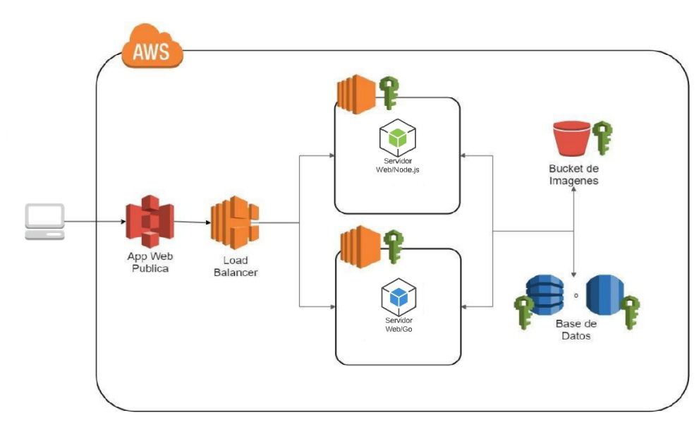
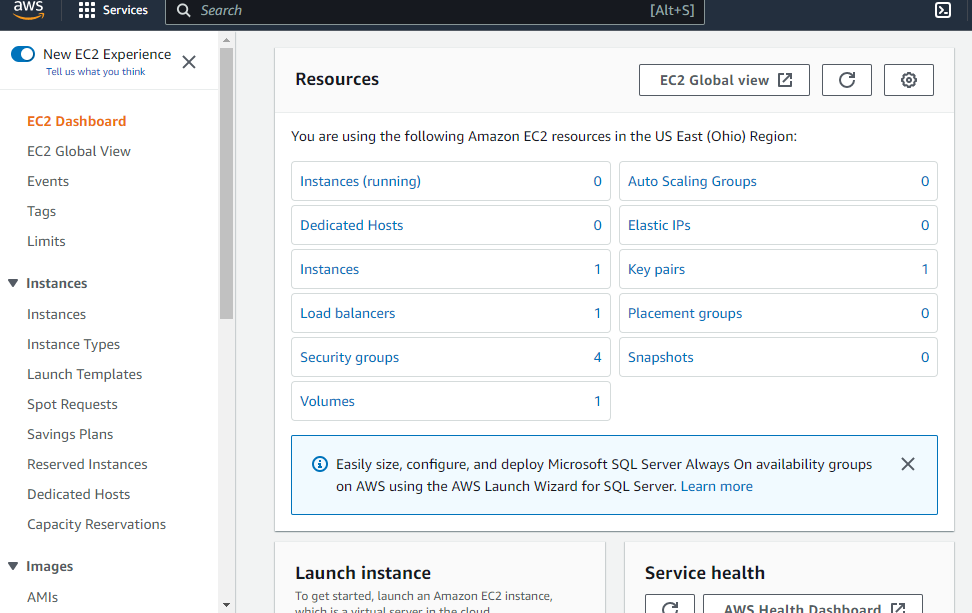
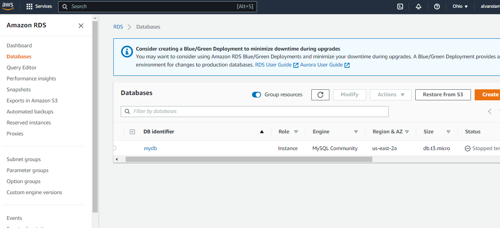
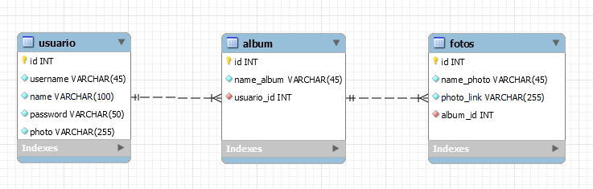
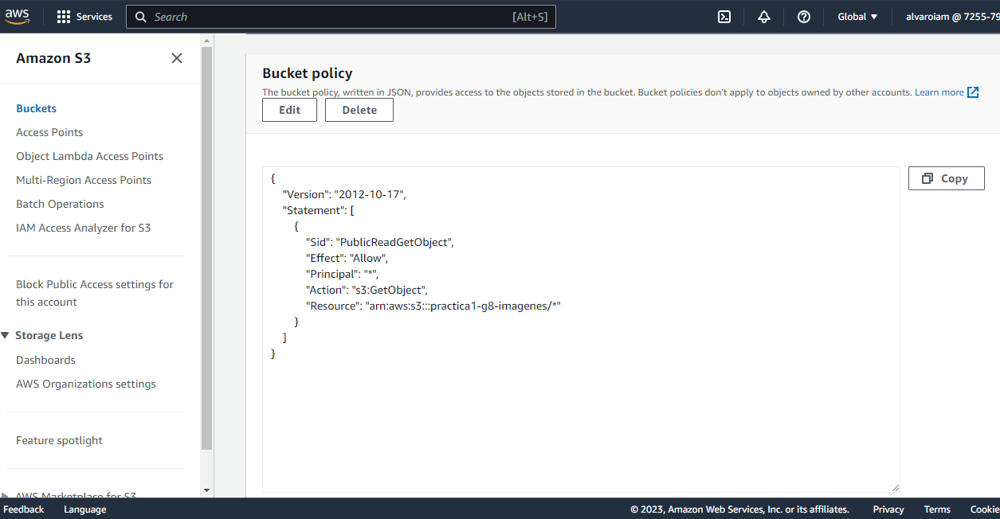
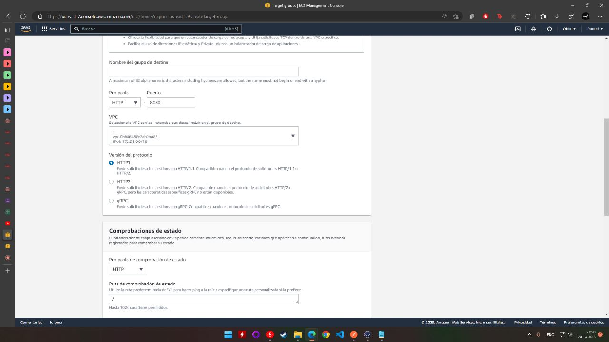

# -Semi1-Practica1_G11
Amazon Web Services (AWS) es una plataforma de servicios de nube que ofrece potencia de cómputo, almacenamiento de bases de datos, entrega de contenido y otra funcionalidad para ayudar a las empresas a escalar y crecer.

UNIVERSIDAD DE SAN CARLOS DE GUATEMALA

FACULTAD DE INGENIERIA

ESCUELA DE CIENCIAS Y SISTEMAS

SISTEMAS OPERATIVOS 1

PRIMER SEMESTRE 2023

---

---

---

---

---

---

---

---

---

---

---

---

---

---

---

| Nombre   |      Carnet      |
|----------|:-------------:|
| Alvaro Emmanuel Socop Pérez | 202000194 |
| Fabian Esteban Reyna Juárez  | 202003919 |
| Javier Alejandro Gutiérrez de León | 202004765|
| Bryan Eduardo Gonzalo Méndez Quevedo    | 201801528      |

---

>“Programa Orquestado en Docker-compose.”
## ÍNDICE
| Topico | Link |
| ------ | ------ |
| Introducción | [Ir](#intro) |
| Objetivos y alcances del sistema| [Ir](#ob) |
| Componentes utilizados | [Ir](#sis) |
| Sistema Operativo | [Ir](#sis) |
| Tecnologías utilizadas | [Ir](#tech) |
| Interfaz del programa | [Ir](#inter) |
| Conclusiones | [Ir](#Conclu) |

# PhotoBucket in AWS Cloud Tools

## INTRODUCCIÓN

Esta documentación describe la implementación de una aplicación de calculadora básica utilizando React para la interfaz de usuario, Golang para el back-end, y MySQL para almacenar los registros de operaciones. Además, se utilizó Docker Compose para orquestar la aplicación y se creó un contenedor en Alpine para ejecutar un script que muestra los reportes solicitados.

## Objetivos

El objetivo de esta aplicación es satisfacer las necesidades de los usuarios creando una galeria de photos y comprender el uso de las herramientas de AWS básica , mientras que también demuestra la utilización de diversas tecnologías de desarrollo de software. Específicamente, los objetivos de la aplicación son:

- Comprender la arquitectura de cloud computing y los principales servicios de AWS
- Conectar la aplicación de React con el Crear un entorno de desarrollo para una aplicación web
- Implementar una arquitectura en la nube.
- Integrar servicios de AWS
## Arquitectura utilizada
- Amazon S3: 
para almacenar las imágenes de la aplicación de forma escalable y duradera. Las imágenes se pueden cargar y descargar mediante una API RESTful proporcionada por Amazon S3.

- Amazon RDS: 
para alojar la base de datos MySQL que contiene los enlaces a las imágenes almacenadas en Amazon S3. La base de datos se puede acceder mediante un cliente MySQL estándar o mediante una API de acceso a datos proporcionada por AWS.

- Amazon EC2: 
para ejecutar las instancias de la aplicación que se conectarán al balanceador de carga. La aplicación se puede empaquetar en un contenedor de Docker para una fácil implementación y escalabilidad.

- Amazon ELB: 
para distribuir la carga de tráfico entre las instancias de la aplicación. Amazon ELB proporciona un punto de entrada único para la aplicación y puede equilibrar la carga de manera inteligente en función de la carga actual de las instancias.

## Configuraciones Principales
Estas son algunas configuraciones necesarias para establecer la aplicacion web PhotoBucket que se ha realizado utilizando herramientas de AWS

### Configuracion de las EC2

- Acceder a la consola de AWS y seleccionar el servicio de EC2.

- Hacer clic en "Launch Instance" para comenzar a crear una instancia.

- Elegir una AMI (Amazon Machine Image) que contenga el sistema operativo y software que necesites para tu aplicación.

- Elegir el tipo de instancia.

- Configurar las opciones de almacenamiento, incluyendo el tipo y el tamaño de la instancia EBS (Elastic Block Store).
- Configurar las opciones de seguridad, como la creación o selección de un grupo de seguridad que permita el tráfico necesario para tu aplicación.

- Añadir etiquetas a la instancia para identificarla fácilmente.

- Revisar y confirmar los detalles de la instancia antes de lanzarla.

Esperar a que se inicie la instancia y obtener su dirección IP pública o DNS.

Posteriormente con algun cliente SSH podemos acceder a las consolas e iniciar cada API

### Configuracion de RDS con MySQL

El modelo de MySQL que se describe consta de tres tablas: "usuario", "album" y "fotos".

La tabla "usuario" tiene las columnas 
- "username", 
- "name", 
- "password" y 
- "photo". 

Estas columnas representan el nombre de usuario, el nombre real del usuario, la contraseña del usuario y la foto del usuario, respectivamente.

La tabla "album" tiene la columna "name_album", que representa el nombre del álbum. 

Cada usuario puede tener varios álbumes, por lo que la tabla "album" está relacionada con la tabla "usuario" mediante una clave foránea.

La tabla "fotos" tiene las columnas 
- "name_photo", 
- "photo_link" y 
- "album_id". 

La columna "name_photo" representa el nombre de la foto, la columna "photo_link" representa el enlace a la foto y la columna "album_id" es una clave foránea que se relaciona con la tabla "album". Cada álbum puede tener varias fotos.

- DB corriendo en una RDS de AWS.

Utilizado para almacenar  los usuarios, albumes y fotos.

### Configuracion de S3 Bucket para almacenar fotos
- bucket con sus carpetas correspondientes.

- Politica del bucket.

### Configuracion de ELB Balanceador de Carga
- primeros pasos configurando el ELB

- teniendo las EC2 creadas se crea la seguridad de grupos

- Balanceador de carga configurado con seguridad de grupos y las instancias configuradas en 50%.

## Tecnologias utilizadas

La aplicación de Fotos se compone de varios componentes, cada uno de los cuales se describe a continuación:

### Angular
Angular se utiliza para crear la interfaz de usuario de la aplicacion de FOTOS la cual muestra cada uno de los modulos.

### NodeJS
Se ha creado el servidor web de la aplicación

### Golang

Se creo el back-end de la aplicación para servir los endpoints necesarios para la app de fotos.

## Conclusiones

 Los servicios de AWS son altamente escalables, lo que significa que pueden crecer o disminuir según las necesidades de la aplicación. Esto es especialmente importante para una aplicación como Photobucket que puede tener un gran número de usuarios y archivos.

 El uso de los servicios de AWS como S3, RDS y ELB puede proporcionar una serie de ventajas importantes para una aplicación web como Photobucket, incluyendo escalabilidad, confiabilidad, seguridad, fácil integración y ahorro de costos.

## Anexos

### Requisitos previos
Antes de comenzar la implementación de la arquitectura, se deben cumplir los siguientes requisitos previos:

- Una cuenta de AWS con permisos para crear y configurar los servicios necesarios.

- Conocimientos básicos de programación en Go y Node.js.

- Conocimientos básicos de Docker y Docker Compose.

- Una imagen de la aplicación Go y otra de la aplicación Node.js listas para ser implementadas.

- Creación de los servicios de AWS
Para crear la arquitectura descrita, se deben crear los siguientes servicios de AWS:

- Un bucket de Amazon S3 para almacenar las imágenes de la aplicación.

- Una instancia de Amazon RDS con MySQL.

- Una instancia de Amazon EC2 con Docker instalado para ejecutar las instancias de la aplicación.

- Un balanceador de carga de Amazon ELB para distribuir la carga de tráfico.

- Una función de AWS Lambda para procesar las imágenes.

### Configuración de la base de datos de MySQL
Después de crear la instancia de Amazon RDS con MySQL, se deben configurar las siguientes opciones:

- Crear una base de datos para almacenar los enlaces a las imágenes.

- Crear un usuario con permisos de lectura y escritura en la base de datos.

- Configurar el grupo de seguridad para permitir el acceso a la instancia de Amazon EC2 que alojará la aplicación.

- Configuración de la instancia de Amazon EC2

- Configurar las variables de entorno de LA EC2 para incluir las credenciales de acceso a la base de datos y al bucket de Amazon S3.

- Configurar el archivo de Docker Compose para definir los servicios de la aplicación Go y Node.js.

- Configurar el grupo de seguridad para permitir el acceso al balanceador de carga de Amazon ELB.

- Configuración del balanceador de carga de Amazon ELB
Después de crear el balanceador de carga de Amazon ELB, se deben configurar las siguientes opciones:

- Configurar el balanceador de carga para distribuir la carga de tráfico entre las instancias de la aplicación.

- Configurar el grupo de seguridad para permitir el acceso al balanceador de carga desde Internet.
